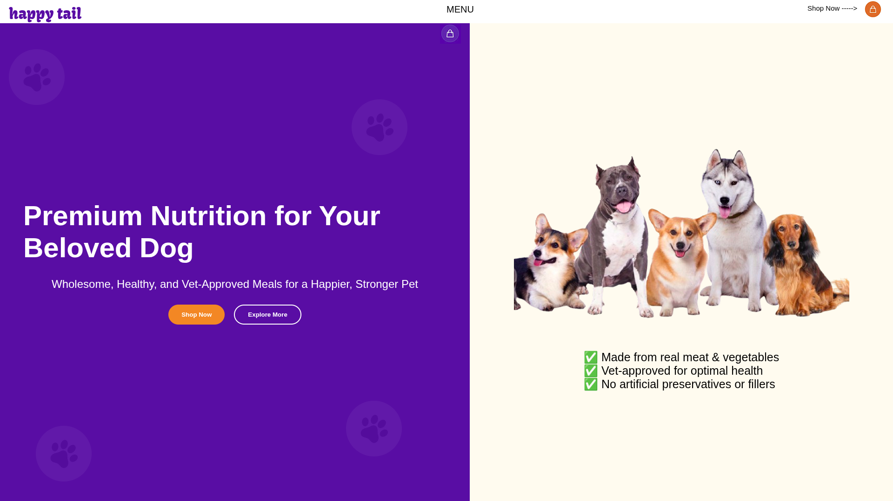

# Preview do Projeto 


# 🐾 Happy Tail - De Ponta a Ponta: Do Figma ao Código


O **Happy Tail** é uma landing page de nutrição canina premium desenvolvida como um projeto acadêmico. O diferencial deste projeto foi seguir o fluxo real de um desenvolvedor front-end: a partir de uma referência, criei o design no Figma e, posteriormente, realizei o "hand-off" para o código (HTML/CSS).

---

## 🛣️ O Processo de Desenvolvimento

O projeto foi executado seguindo o fluxo profissional de UI/UX e Desenvolvimento:

1.  **Análise de Referência:** Estudo de um site real para entender a hierarquia de informações, disposição de elementos e experiência do usuário.
2.  **Prototipagem no Figma:** Redesign completo da interface dentro do Figma, definindo a paleta de cores, tipografia, componentes de botões e o layout responsivo.
3.  **Desenvolvimento Web:** Tradução do design para código limpo, garantindo que o layout final fosse pixel-perfect em relação ao protótipo.

---

## 🛠️ Desafios Técnicos Superados

* **Fidelidade ao Design:** Implementação rigorosa do layout planejado no Figma utilizando **Flexbox** para o alinhamento das seções.
* **Elementos Decorativos:** Gerenciamento de elementos visuais (as patinhas) utilizando `position: absolute` e `fixed` para criar profundidade sem quebrar o fluxo do conteúdo.
* **Responsividade Multi-nível:** Criação de `@media queries` específicas para 768px (Tablets) e 480px (Mobile), adaptando o layout de duas colunas para uma navegação vertical fluida.

---

## 🎨 Especificações do Projeto

* **Tipografia:** `Kavoon` (Títulos) e `Righteous` (Corpo) via Google Fonts.
* **Cores Principais:**
    * **Primária:** `#FFFAEF` (Creme suave)
    * **Secundária:** `#4A44A3` (Roxo Moderno)
    * **Destaque:** `#e58a3a` (Laranja CTA)

---

## 📂 Estrutura de Arquivos

```text
├── index.html      # Estrutura principal
├── style.css       # Estilização e Responsividade
├── reset.css       # Normalização de estilos entre navegadores
└── img/            # Ativos visuais (Logos, patinhas e fotos)
```
---
# Autora
[Daniele Silva Santos](https://www.linkedin.com/in/danielesilvasantos/)

